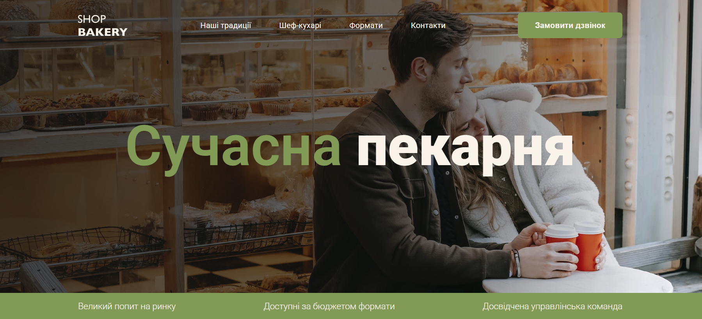

# 🥐 Shop Bakery

A fully responsive, single-page website created to demonstrate my front-end skills.  
The project was implemented based on a provided Figma design.

🔗 **[Live Demo](https://bakery-shop-kv.netlify.app/)**

---

## 🖼️ Project Preview

<p align="center">
  
</p>

---

## 🚀 Technologies

- **HTML5 / SCSS** (BEM methodology, mixins, variables)
- **SCSS** (compiled into CSS)
- **Vanilla JavaScript**
- **Swiper.js**

---

## ⚙️ Installation and Usage

### Installation

Clone the repository and open it locally:

```bash
git clone https://github.com/klyuchukviktoriya/bakery.git
cd bakery
```
Open in your browser at  
👉 [index.html](index.html)

---

## 📦 Structure

- scss/     — source styles
- css/      — compiled styles
- js/       — scripts
- images/   — images
- index.html
---

## 👩‍💻 Author

**Viktoriya Klyuchuk**  
Frontend Developer Student — *IT Connect UA / EPAM Campus*
